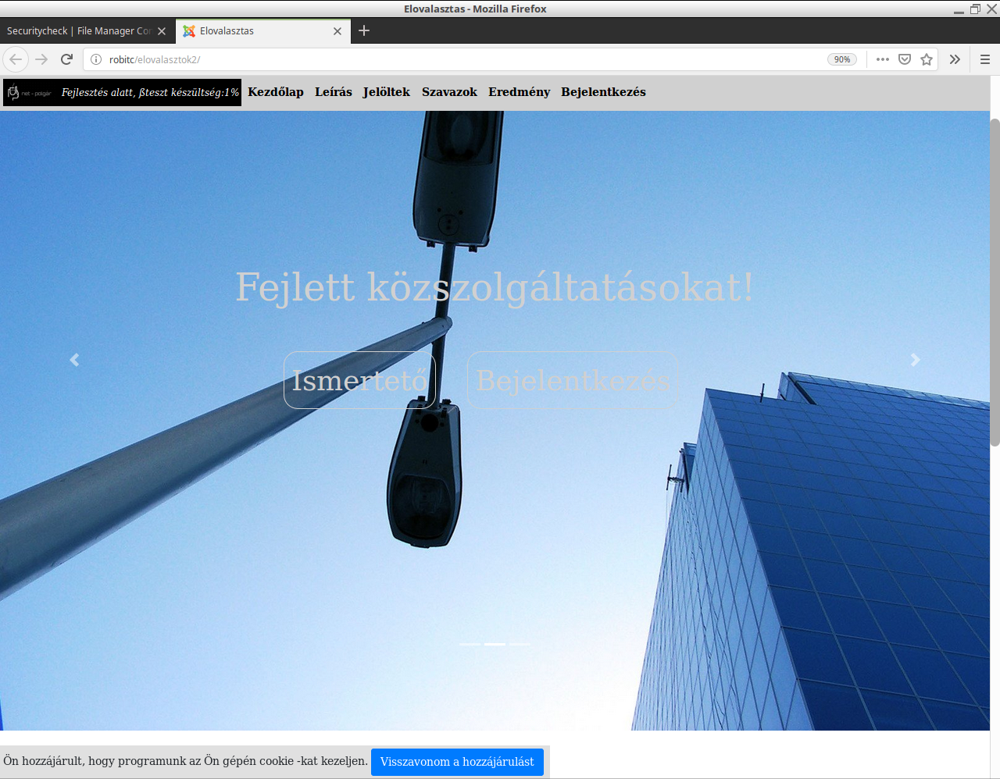
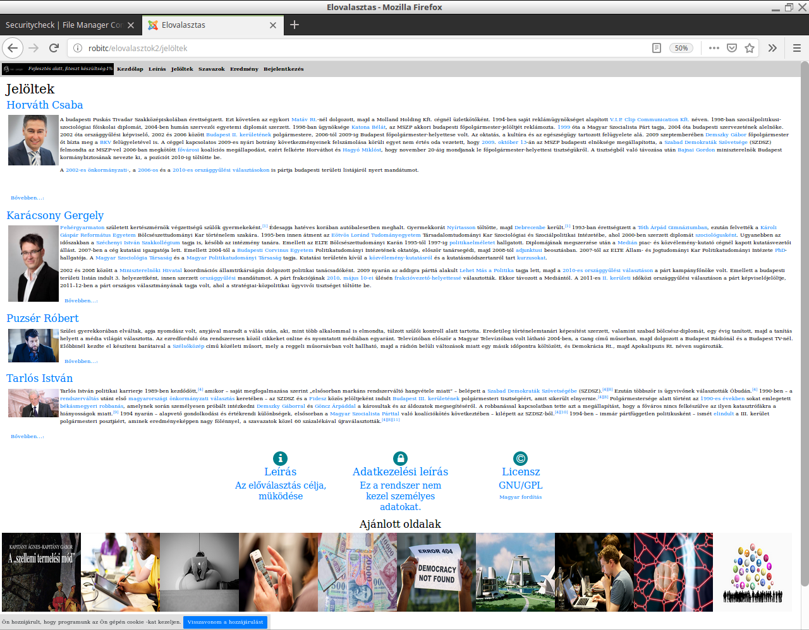
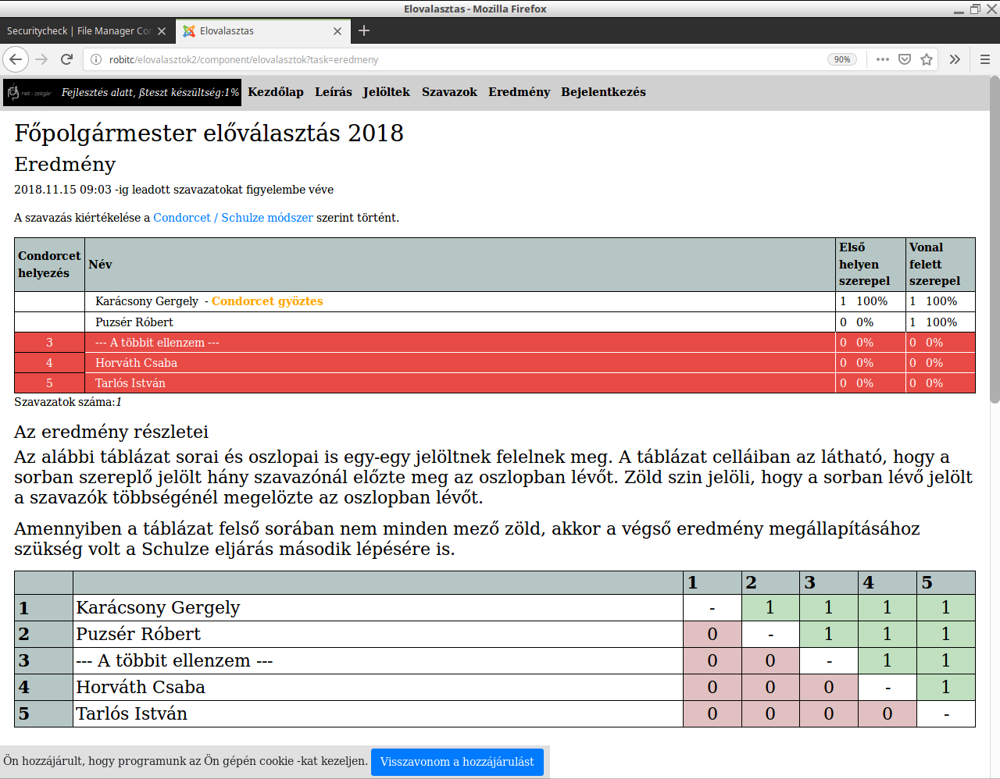
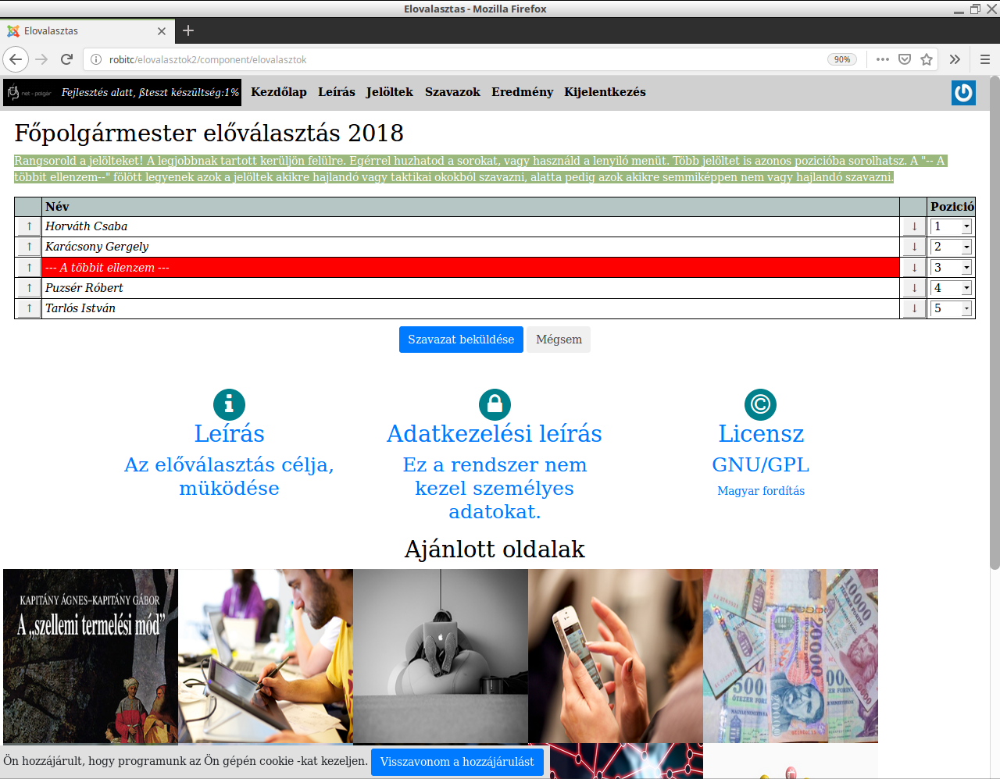
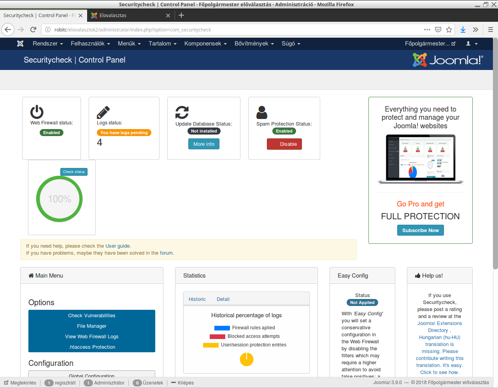
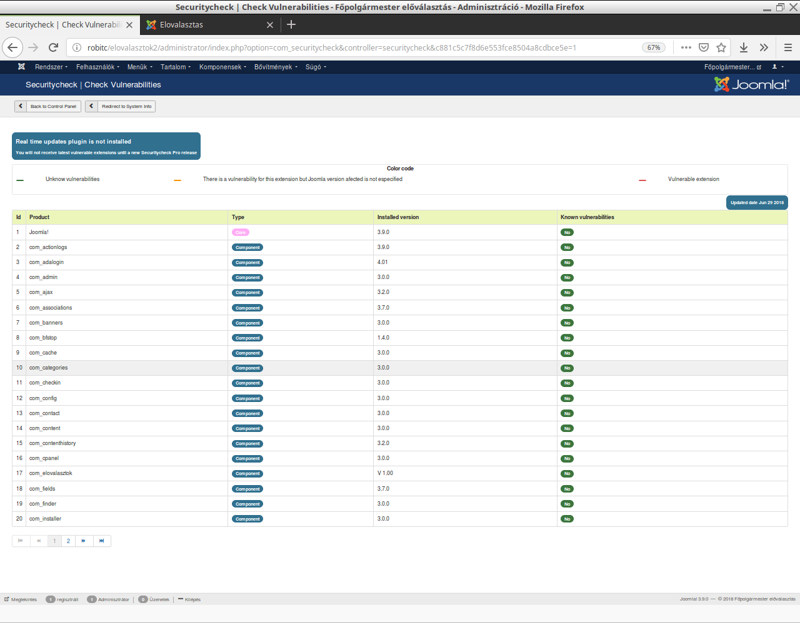
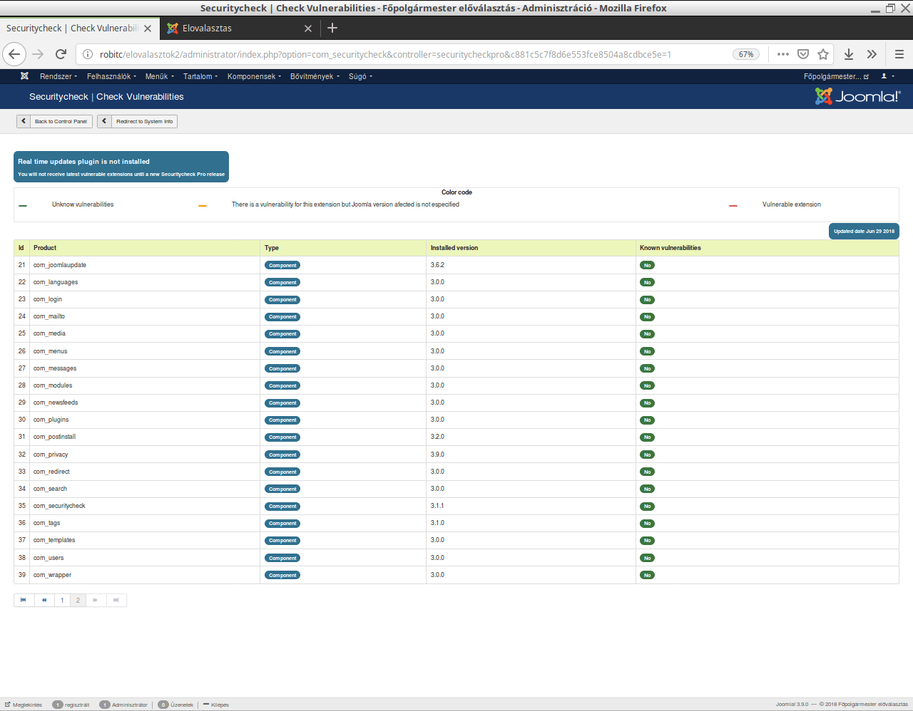

# elovalasztok2018
Ez a 2018 -as főpolgármester előválasztásra készülő Joomla 3 alapú szoftver

Tulajdonságok
-------------

- Preferenciális szavazás,
- Condorcet kritérium szerinti kiértékelés,
- Taktikai szavazás szempontjából a legelfogadottabb jelölt kimutatása,
- Joomla MVC program struktúra
- Biztonságos

Telepités:
----------

- Normál Joomla 3 telepités
- bfstop, securitycheck kiegészitések telepitése a jooma extension könyvtárból, ezek konfigurálása
- com_adalogin kiegészitő telepitése (github repoból) és konfigurálása
- A jelen repo component könyvtárban szerepló com_elovalasztok joomla komponens telepitése (joomla telepités könyvtárból funkció segitségével)
- joomla kategoria kialakitása a szavazásnak, ebbe cikkeknek felvinni a jelölteket
- a com_elovalasztok/config.php értelemszerű modosítása
- Dizájn kialakitása - jelen repo templates könyvtára is használható
- Joomla konfigurálás, menüpontok kialakitása stb
- File jogosultságok beállítása

A com_adalogin funkciók hívása:

szavazás beküldése:

component/elovalasztok?task=szavazok

eredmény lekérés:

component/elovalasztok?task=eredmeny


A müködés áttekintése
---------------------

- Egy joomla kategoria képviseli a szavazást,
- Az ebben lévő cikkek képviselik az egyes jelölteket,
- A szavazáshoz ADA login és "budapest" tanusitás szükséges,
- A szavazat beküldése után a képernyőn megjelenik a szavazat gépileg képzett egyedi azonsító száma,
- A program egy ADA logintól csak egy szavazatot fogad el,
- Az eredmény lekérdezése funkcióban lekérhető a konkrét szavazatok listája is. Ezen a listán a szavazatok egyedi azonosítói is szerepelnek, a szavazó ellenőrizheti, hogy az Ő szavazata szerepel-e az adatbázisban? (Ezekből az azonoítókból nem lehet kideriteni a szavazó személyét),
- Az adatbázisban tárolt szavazatok CSV formában is lementhetőek, Ennek segitségével külső, független személyek, szervezetek is ellenörizhetik a condorcet kiértékelés eredményét. Illetve a szavazás folyamán idöszakonkénti mentések és a lezárás utáni mentés összevetésével ellenörizhető, hogy menet közben nem történ módosítás a korábban leadott szavazatokban, történt-e kiugró irreális mennyiségű szavazat leadás egy-egy időszakban.
 

UNIT test
---------


```
$ cd test
$ phpunit .
```

Sonar code check
----------------

[sonar](https://sonarcloud.io/dashboard?id=utopszkij_elovalasztok2018)

Biztonsági megjegyzések
-----------------------

1. A joomla rendszer NE ROOT jogú mysql loginnal müködjön, a joomla által használt mysql loginnak NE LEGYEN JOGA triggert felvinni, törölni, létrehozni!
2. A mysql root login, a program által használt mysql login és a joomla admin login és sziguruan bizalmassan kezelendő!
3. A szerver rendszergazdának más eszközzel (linux konzol + mysql parancssor) kell a biztonsági triggereket telepítenie jelen repoból
4. A rendszer adminisztrátorok és a joomla adminisztrátorok erős jelszavakat használjanak, azt gyakran modosítsák és biztonságosan kezeljék!
5. A szerveren a php fájlok irását, modosítását, törlését a rendszer telepítése után az appache user számára le kell tiltani.
6. A joomla jogosultsági rendszert gondosan konfigurálni kell (csak a joomla adminok vihetnek fel, modosithatnak, törölhetnek cikk-kategoriákat és cikkeket, a szavazás megindulása után még ők sem).
7. A joomla által használt mysql jelszót időszakonként módosítani kell.
8. a mysql szerver ne legyen külső URL -ről elérhető!
9. A joomla_root/administrator/index.php üzemszerüen ne legyen az appache által elérhető (olvasásra sem!)


Biztonsági megoldások a programban.
-----------------------------------

Általános Joomla védelem

1. Joomla beépített CSR védelem aktív,
2. Joomla bfstop védelem aktív,
3. Joomla securityCheck admin dir védelem és spam védelem aktív


Szavazat beküldése

1. ADA login, "budapest" területi tanusitvány, és joomla login  kell hozzá,
2. Joomla login szükséges hozzá, (első ADA -ból érkező bejelentkezésnél automatikusan létrejön, de ezután az admin letilhatja),
3. A program biztositja, hogy csak egyszer lehet szavazni,
4. A szavazás lezárása után a progam nem enged tovább szavazni, További biztonság növelésként az admin az appache MYSQL usertől elveheti a szavazat tábla írási, modositási jogot

Szavazat törlése

1. A programban nincs ilyen funkció,
2. mysql trigger megakadályozza.

Szavazat modosítása

1. A programban nincs ilyen funkció,
2. mysql trigger megakályozza

Néhány képernyő kép
-------------------









Joomla checker result
---------------------








